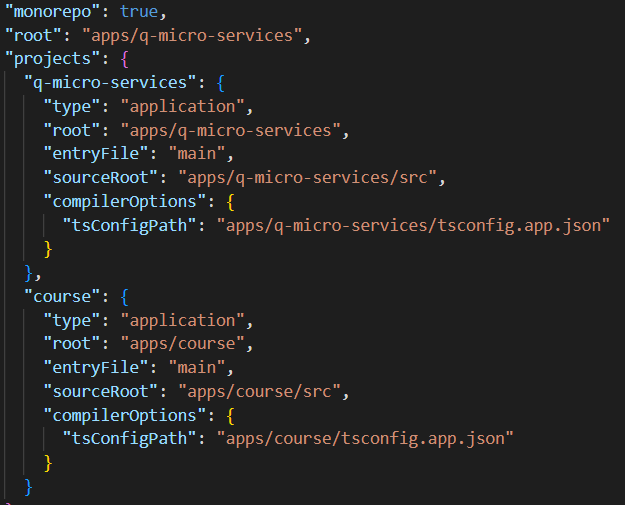
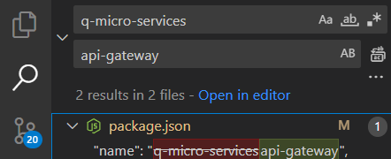
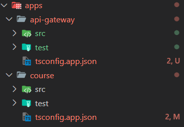

# Project Q-Microservices


A progressive [Node.js](http://nodejs.org) framework for building efficient and scalable server-side applications.

[](https://www.npmjs.com/~nestjscore)
[](https://www.npmjs.com/~nestjscore)
[](https://www.npmjs.com/~nestjscore)
[](https://circleci.com/gh/nestjs/nest)
[](https://coveralls.io/github/nestjs/nest?branch=master)
[](https://discord.gg/G7Qnnhy)
[](https://opencollective.com/nest#backer)
[](https://opencollective.com/nest#sponsor)
[](https://paypal.me/kamilmysliwiec)
[](https://opencollective.com/nest#sponsor)
[](https://twitter.com/nestframework)

## Description

[Nest](https://github.com/nestjs/nest) framework TypeScript starter repository.

## Project setup

```bash
pnpm install
```

## Compile and run the project

```bash
# development
$ pnpm run start

# watch mode
$ pnpm run start:dev

# production mode
$ pnpm run start:prod
```

## Run tests

```bash
# unit tests
$ pnpm run test

# e2e tests
$ pnpm run test:e2e

# test coverage
$ pnpm run test:cov
```

## Resources

Check out a few resources that may come in handy when working with NestJS:

- Visit the [NestJS Documentation](https://docs.nestjs.com) to learn more about the framework.
- For questions and support, please visit our [Discord channel](https://discord.gg/G7Qnnhy).
- To dive deeper and get more hands-on experience, check out our official video [courses](https://courses.nestjs.com/).
- Visualize your application graph and interact with the NestJS application in real-time using [NestJS Devtools](https://devtools.nestjs.com).
- Need help with your project (part-time to full-time)? Check out our official [enterprise support](https://enterprise.nestjs.com).
- To stay in the loop and get updates, follow us on [X](https://x.com/nestframework) and [LinkedIn](https://linkedin.com/company/nestjs).
- Looking for a job, or have a job to offer? Check out our official [Jobs board](https://jobs.nestjs.com).

## License

Nest is [MIT licensed](https://github.com/nestjs/nest/blob/master/LICENSE).

### Mar Documentation

  Note: Tutorial [Link](https://youtu.be/UkWcjVWs2UQ?si=Dhw-9xBR84zV3g9u) to follow

#### Steps

1. Install the required packages by running the following command:

   ```bash
   # to get the latest nestjs version on your projects (globally)
   $ npm install -g @nestjs/cli@latest

   # to start this project
   $ nest new q-micro-services
   ```

   

   *Note: I use pnpm as the package manager.*

2. Test:

   

3. Create our microservice to Manage Courses, but first we need to convert this project to mono-repo:

   ```bash
   # generate microservice for courses
   # microservice would be the folder, and course will be a sub directory that will handle the things for the microservices
   $  nest generate microservice course

   # but for convention I used app/course
   $  nest generate app course
   ```

   file-structure:

      

   nest-cli.json:

      

4. Renaming for uniform code: From Q-Micro-Service -> api-gateway

   For a proper API naming of the api-gateway that will recieve all the traffice of all the http request in the app by proxing those calls to the microservices using gRPC.

    

   Note: I still save some of the app name, so you still can search q-microservices

5. Test the courses

   ```bash
   # you can test to its specific gateway
   $ pnpm run start:dev course
   ```

   This will cause an error because of the image below and still listening to both port 3000. We can solve it using gRPC.

   

   So we will install grpc and grpc-tools to generate the proto file and the client for the microservices.

   ```bash
   # you can test to its specific gateway
   $ pnpm i --save @nestjs/microservices @grpc/grpc-js @grpc/proto-loader ts-proto
   ```

   Remove files
   apps
   ---- api-gate-way
   ---- course
   ---------src
   ------------ course.controller (remove)
   ------------ course.service (remove)

   And remove all its import in the course module, then we will use commandline to generate its resouces to perform CRUD.

   ```bash
   # you can test to its specific gateway
   $ nest g resource course
   # then choose course (microservice and y), this will generate files from course folder 
   ```

6. [Current](https://youtu.be/UkWcjVWs2UQ?t=591)

   protoc --plugin=./node_modules/. bin/protoc-gen-ts_proto --ts_proto_out=./ --ts_proto_opt=nestJs=true ./proto/course.proto
It seems that `protoc`, the Protocol Buffers compiler, is not installed on your system. You will need to install it to be able to compile `.proto` files. Here’s how you can install and set it up:

### Step 1: Install `protoc`

To install `protoc`, follow the appropriate steps based on your operating system:

#### For Windows (using Chocolatey)

1. Open PowerShell as Administrator.
2. Run the following command:

   ```bash
   choco install protoc
   ```

3. Verify the installation by checking the version:

   ```bash
   protoc --version
   ```

### Step 2: Install `ts-proto` and other dependencies

Ensure you have `ts-proto` installed in your project:

```bash
npm install ts-proto
```

### Step 3: Generate TypeScript Protobuf Files

Once `protoc` is installed, you should be able to run the command to generate the TypeScript code with `nestJs` options:

```bash
protoc --plugin=./node_modules/.bin/protoc-gen-ts_proto --ts_proto_out=./ --ts_proto_opt=nestJs=true ./proto/course.proto
```

### Step 4: Verify the Setup

If everything is installed correctly, running `protoc --version` should display the version number, and the generation of TypeScript files should work as expected.

protoc --plugin=./node_modules/.bin/protoc-gen-ts_proto --ts_proto_out=./ --ts_proto_opt=nestJs=true ./proto/course.proto
protoc --plugin=protoc-gen-ts_proto=C:/Users/joema/AppData/Roaming/npm/protoc-gen-ts_proto.cmd --ts_proto_out=./src --ts_proto_opt=nestJs=true ./proto/course.proto
