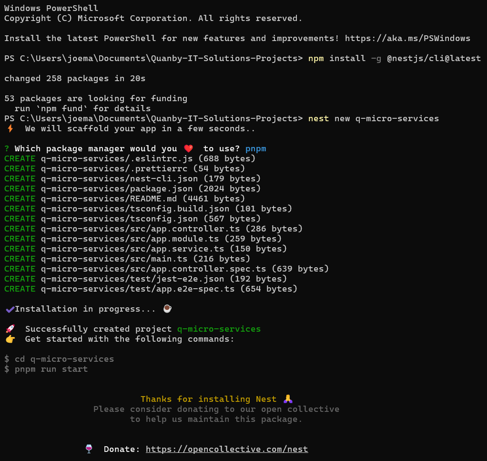
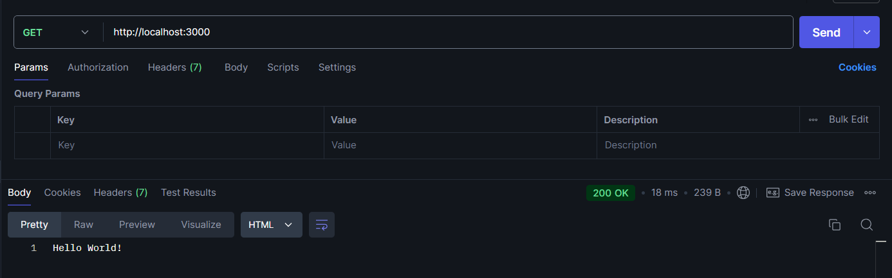
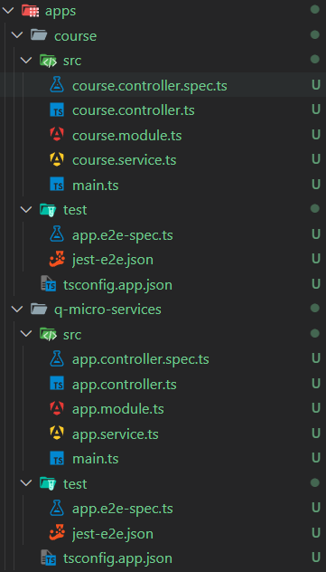

# Project Q-Microservices


A progressive [Node.js](http://nodejs.org) framework for building efficient and scalable server-side applications.

[](https://www.npmjs.com/~nestjscore)
[](https://www.npmjs.com/~nestjscore)
[](https://www.npmjs.com/~nestjscore)
[](https://circleci.com/gh/nestjs/nest)
[](https://coveralls.io/github/nestjs/nest?branch=master)
[](https://discord.gg/G7Qnnhy)
[](https://opencollective.com/nest#backer)
[](https://opencollective.com/nest#sponsor)
[](https://paypal.me/kamilmysliwiec)
[](https://opencollective.com/nest#sponsor)
[](https://twitter.com/nestframework)

## Description

[Nest](https://github.com/nestjs/nest) framework TypeScript starter repository.

## Project setup

```bash
pnpm install
```

## Compile and run the project

```bash
# development
$ pnpm run start

# watch mode
$ pnpm run start:dev

# production mode
$ pnpm run start:prod
```

## Run tests

```bash
# unit tests
$ pnpm run test

# e2e tests
$ pnpm run test:e2e

# test coverage
$ pnpm run test:cov
```

## Resources

Check out a few resources that may come in handy when working with NestJS:

- Visit the [NestJS Documentation](https://docs.nestjs.com) to learn more about the framework.
- For questions and support, please visit our [Discord channel](https://discord.gg/G7Qnnhy).
- To dive deeper and get more hands-on experience, check out our official video [courses](https://courses.nestjs.com/).
- Visualize your application graph and interact with the NestJS application in real-time using [NestJS Devtools](https://devtools.nestjs.com).
- Need help with your project (part-time to full-time)? Check out our official [enterprise support](https://enterprise.nestjs.com).
- To stay in the loop and get updates, follow us on [X](https://x.com/nestframework) and [LinkedIn](https://linkedin.com/company/nestjs).
- Looking for a job, or have a job to offer? Check out our official [Jobs board](https://jobs.nestjs.com).

## License

Nest is [MIT licensed](https://github.com/nestjs/nest/blob/master/LICENSE).

### Mar Documentation

  Note: Tutorial [Link](https://youtu.be/UkWcjVWs2UQ?si=Dhw-9xBR84zV3g9u) to follow

#### Steps

1. Install the required packages by running the following command:

   ```bash
   # to get the latest nestjs version on your projects (globally)
   $ npm install -g @nestjs/cli@latest

   # to start this project
   $ nest new q-micro-services
   ```

   

   *Note: I use pnpm as the package manager.*

2. Test:

   

3. Create our microservice to Manage Courses, but first we need to convert this project to mono-repo:

   ```bash
   # generate microservice for courses
   # microservice would be the folder, and course will be a sub directory that will handle the things for the microservices
   $  nest generate microservice course

   # but for convention I used app/course
   $  nest generate app course
   ```

   

4. A

    b
